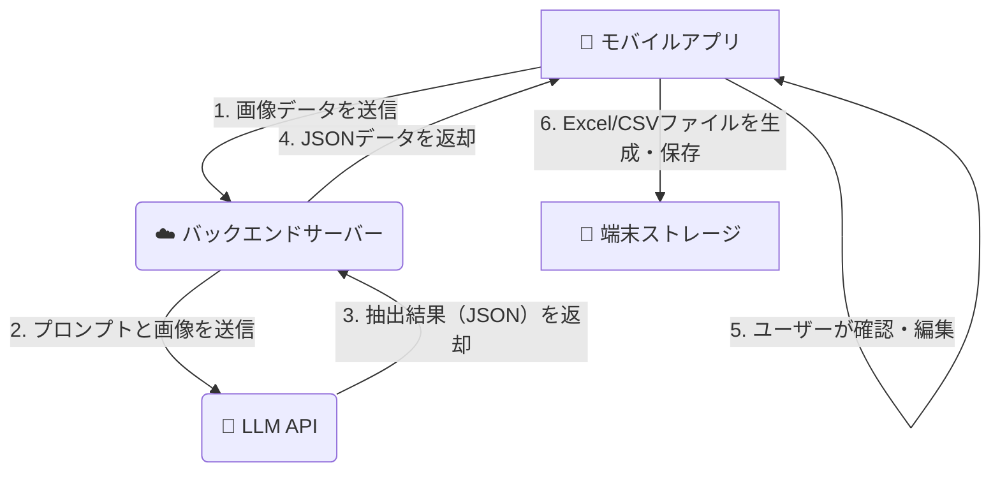
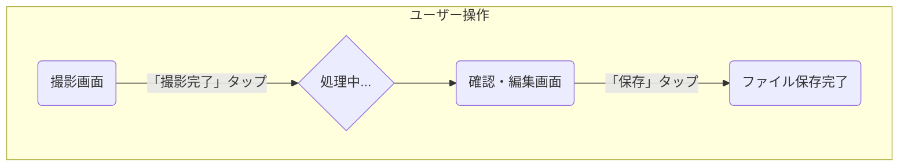

# 健康診断結果OCRアプリケーション 詳細設計書（Gemini 2.5 pro）

## **1. アプリケーション概要・目的**

### **1.1. 目的**

従業員から会社へ提出される紙媒体の健康診断結果を電子データ化し、特に「有所見項目」を効率的に抽出・管理することで、役所への報告業務を自動化・効率化することを目的とする。

### **1.2. 概要**

本アプリケーションは、モバイル端末のカメラで撮影した健康診断結果の画像をLLM APIを用いてOCR・構造化データ抽出し、ユーザーによる確認・修正を経て、最終的にExcel（またはCSV）形式で端末に保存する機能を提供する。

---

### **2. アーキテクチャ**

### **2.1. 構成要素**

本システムは以下の3つの要素で構成される。

- **モバイルアプリケーション（クライアント）**
    - ユーザーインターフェースを提供。
    - カメラでの画像撮影、撮影セッション（複数ページ）の管理、バックエンドへの画像送信、結果の表示・編集、最終的なファイル生成・保存を行う。
- **バックエンドサーバー（BFF: Backend for Frontend）**
    - クライアントとLLM APIの中継役を担う。
    - クライアントから画像データを受け取る。
    - LLM APIキーを安全に管理し、クライアントに代わってLLM APIを呼び出す。
    - LLM APIからのレスポンス（JSON）をクライアントに返却する。
    - ※プロトタイプ段階では、Google Cloud FunctionsやAWS Lambdaなどのサーバーレス環境を推奨。
- **LLM API（外部サービス）**
    - `Chat GPT-5 thinking (API)` を想定。
    - 画像を入力として受け取り、OCRと構造化データ抽出を実行し、結果をJSON形式で返却する。

### **2.2. システム構成図とデータフロー**

コード スニペット



---

### **3. 画面仕様・画面遷移図**

### **3.1. 画面遷移図**

コード スニペット



### **3.2. 各画面の仕様**

- **① 撮影画面**
    - **目的:** 健康診断結果を1ページ以上撮影し、1つのセッションとして管理する。
    - **UI要素:**
        - カメラプレビュー
        - 撮影ボタン
        - 撮影済み画像のサムネイル一覧
        - 「次のページを追加」ボタン
        - 「撮影完了」ボタン
    - **動作:** ユーザーは「撮影完了」を押すまで、複数ページの画像を撮影・追加できる。
- **② 確認・編集画面**
    - **目的:** LLMによって抽出されたデータを確認し、必要に応じて修正する。
    - **UI要素:**
        - 抽出結果を表示するリスト/テーブル
            - 各行が1つの検査項目に対応。
            - 列: `項目名`, `値`, `単位`, `判定`
            - `値`, `単位`, `判定` の各セルは編集可能とする。
        - 行を追加するボタン / 削除するボタン
        - 「保存」ボタン
    - **動作:** LLMからのJSONレスポンスを基に画面を構築。ユーザーが「保存」ボタンを押すと、編集後のデータがExcel/CSVとして端末に保存される。

---

### **4. データモデル（最終出力フォーマット）**

- **ファイル形式:** Excel (`.xlsx`) または CSV (`.csv`)
- **データ構造:** 縦持ち形式。1行が1つの検査項目を表す。
- **ファイル名（案）:** `健康診断結果_{氏名}_{受診日}.xlsx`
- **カラム定義:**

| 列名 | データ型 | 説明 | 例 |
| --- | --- | --- | --- |
| `氏名` | String | 受診者の氏名。全行に同じ値が入る。 | 山田 太郎 |
| `受診日` | String | 健康診断の受診日 (YYYY-MM-DD形式)。全行に同じ値。 | 2025-10-03 |
| `検査項目` | String | 検査項目の名称。 | 最高血圧 |
| `値` | String | 検査結果の数値。 | 135 |
| `単位` | String | 検査値の単位。 | mmHg |
| `判定` | String | 検査結果の判定。有所見項目の特定に利用。 | C (要経過観察) |

---

### **5. API仕様（バックエンドサーバーとLLM）**

### **5.1. バックエンドAPI**

- **エンドポイント:** `/process-health-report`
- **HTTPメソッド:** `POST`
- **リクエスト形式:** `multipart/form-data`
    - `images`: 画像ファイル（複数可）
- **レスポンス形式:** `application/json`
    - 成功時: ステータスコード `200` と、LLMが返却したJSONデータ。
    - 失敗時: エラー内容に応じたステータスコードとエラーメッセージ。

### **5.2. LLM APIへの指示（プロンプト）**

バックエンドからLLM APIへ送信する指示の例。

Plaintext

```
# 命令書

あなたは優秀なデータ入力アシスタントです。
提供された複数の健康診断結果の画像から、記載されている情報を正確に読み取り、指定されたJSON形式で出力してください。

# 制約条件

- 画像に記載されている**上から下の順序を維持して**、`検査結果`の配列に要素を追加してください。原本と突き合わせて確認する作業で順序が重要になります。
- 帳票に記載されている全ての検査項目を、漏れなく抽出してください。項目名、値、判定のペアを1つとして扱ってください。
- 項目名は、画像に書かれている表記をできるだけそのまま使用してください。
- 値や判定が見つからない項目は、該当するキーの値を `null` としてください。
- JSON以外の説明や前置きは一切不要です。JSONオブジェクトのみを出力してください。

# 出力フォーマット（JSON）

{
  "受診者情報": {
    "氏名": "string",
    "受診日": "string (YYYY-MM-DD形式を推奨)"
  },
  "検査結果": [
    {
      "項目名": "string",
      "値": "string",
      "単位": "string | null",
      "判定": "string | null"
    }
  ],
  "総合所見": {
    "総合判定": "string | null",
    "医師の所見": "string | null"
  }
}
```

### **5.3. LLMからのJSONレスポンス（例）**

JSON

```json
{
  "受診者情報": {
    "氏名": "山田 太郎",
    "受診日": "2025-10-03"
  },
  "検査結果": [
    {
      "項目名": "身長",
      "値": "170.5",
      "単位": "cm",
      "判定": "A"
    },
    {
      "項目名": "体重",
      "値": "65.2",
      "単位": "kg",
      "判定": "A"
    },
    {
      "項目名": "最高血圧",
      "値": "135",
      "単位": "mmHg",
      "判定": "C"
    },
    {
      "項目名": "LDLコレステロール",
      "値": "145",
      "単位": "mg/dL",
      "判定": "D2"
    }
  ],
  "総合所見": {
    "総合判定": "D2",
    "医師の所見": "血圧、脂質について精密検査を受けてください。"
  }
}
```

---

### **6. 主要な処理フロー**

1. **撮影:** ユーザーはアプリを起動し、「撮影画面」で健康診断結果の全ページを撮影する。「撮影完了」ボタンをタップする。
2. **データ送信:** モバイルアプリは撮影した全画像をバックエンドサーバーの `/process-health-report` エンドポイントにPOSTリクエストで送信する。
3. **LLM処理:** バックエンドサーバーは受け取った画像とプロンプトをLLM APIに送信する。LLMは画像を解析し、結果をJSON形式でバックエンドサーバーに返却する。
4. **データ受信:** バックエンドサーバーはLLMからのJSONをモバイルアプリに返却する。
5. **確認・編集:** モバイルアプリは受け取ったJSONデータを「確認・編集画面」に表示する。ユーザーは内容を確認し、必要であれば修正を行う。
6. **ファイル生成・保存:** ユーザーが「保存」ボタンをタップすると、モバイルアプリは画面上のデータを基に、4.で定義されたフォーマットのExcel/CSVファイルを生成し、端末のストレージに保存する。